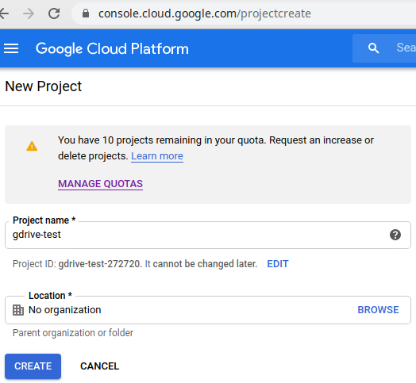
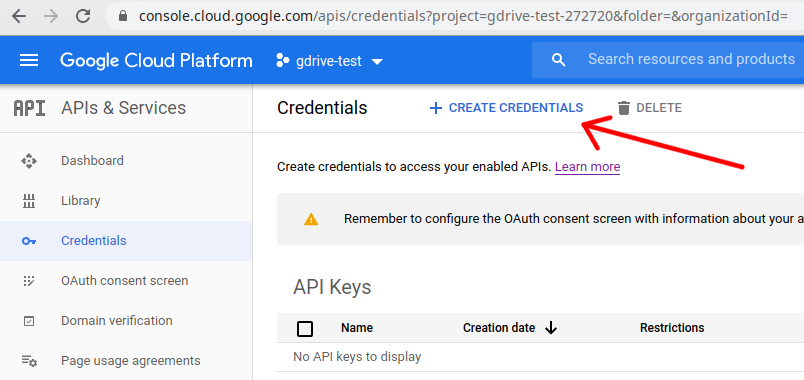
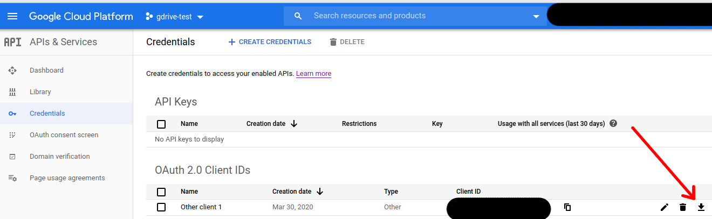
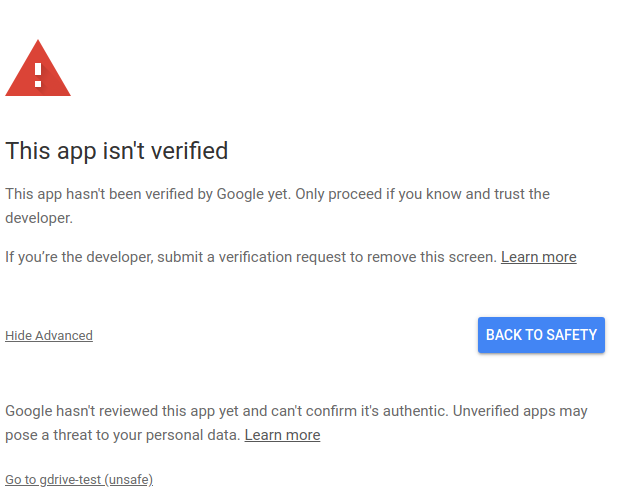

# ATTENTION

`It is not very stable yet. If you want to test it, follow the instruction bellow
and write about issues or fix them via a pull request`

An unofficial client for Google Drive
=====

# How to install

## Compile

First you will need to get `credentials.json` file, that is described in **Get Token**
section. Then just clone the repository and run `go build` with the parameters you need, 
for example `env GOOS=linux GOARCH=amd64 go build` and then just launch `./gdriveapp`.

## Get token

First [create](https://console.cloud.google.com/projectcreate) a project:

Then [go](https://console.cloud.google.com/apis/credentials) to the page with credentials and create them (we need OAuth client):

It forces us to configure "OAuth consent screen". We need `External` user type. 
In the consent screen settings put something in `Application name` and click "Save". 
In this moment we just need the `Application name`. It is just an example of configuration for the application to work.
You are free to change anything you like.

We also need to [enable](https://console.developers.google.com/apis/library/drive.googleapis.com) Google Drive API for 
the created application.

Now we have `Not published` consent screen. 
Now on the [credentials](https://console.cloud.google.com/apis/credentials/oauthclient) create page we 
choose `Application type` as `Other`, pick any name and press "Create" button.

After all the things we've done, we can go to the same `credentials` page and download the credentials 
we created previously:

And save it to /home/`[your-home-dir]`/.config/svetlyi_gdriveapp/credentials.json. It will ask you to go to a link to get the token.
As the application was not verified, we will get a warning, that "This app isn't verified". Just go to "Advanced" and
then "Go to [your-app] (unsafe)":

Then we grant all the permissions it requires (as it is a Google Drive client, it can perform various operations with 
your files such as download, upload and read). After that we will have a code, that we should paste into console and 
press "Enter".

# Notes

* It is not a daemon at this moment, so you need to run it from time to time to synchronize your files. 
Or you can put in cron for example.
* It takes some time for the changes to propagate in Google Drive itself, so when you change something in web interface,
it might take a few minutes to propagate and then the application would download the changes.
* Logs are stored in a temporary location in your OS (`/tmp/svetlyi_gdriveapp.log` for Linux). In case something wrong
happens, the answer might be there.